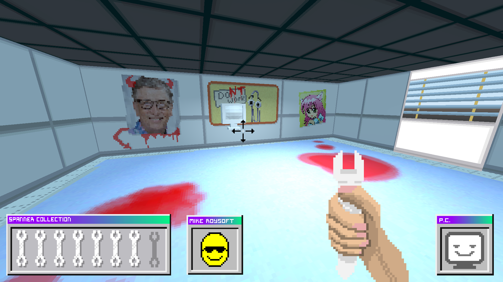
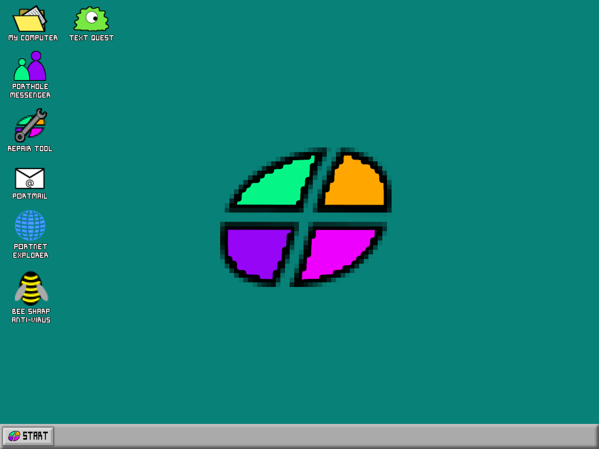
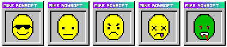
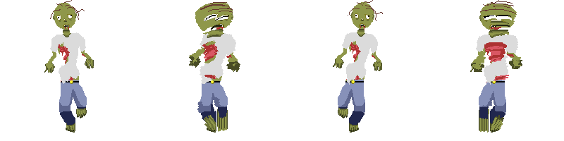
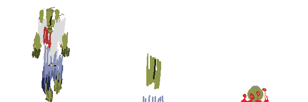

# Fixing Windows - Global Game Jam 2020

## Game Plot:

A game about fixing windows! Both your windows and computer are in constant ruin. The zombies won't hold up on their irratic hunger pilgrimages over the globe. The protagonist, Mike Roysoft is trying to fix his broken computer but barely gets a chance to prevent his house from a wild zombie infestation. He prays for better days but their seems to be no hope for salvation left on the barren yet densly populated city of humans. You may say that is not possible, you're right.

Try to fix your computer and don't let yourself be outrun by the zombie horde. 

# Team updates!

## Love you my brodas

## Sleeping time 😴
